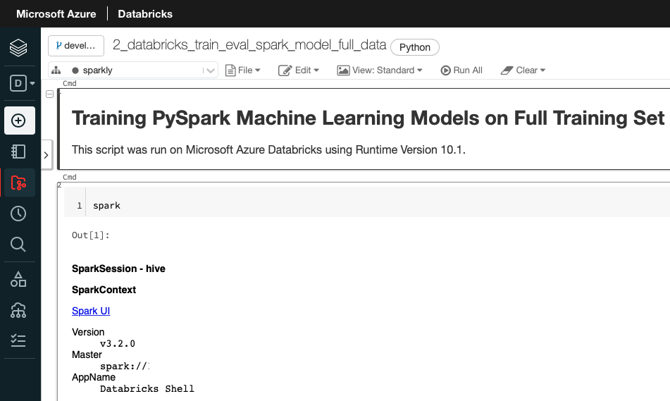
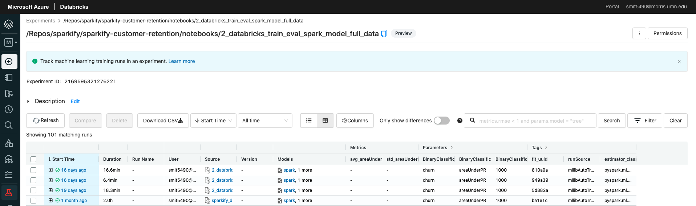
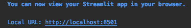
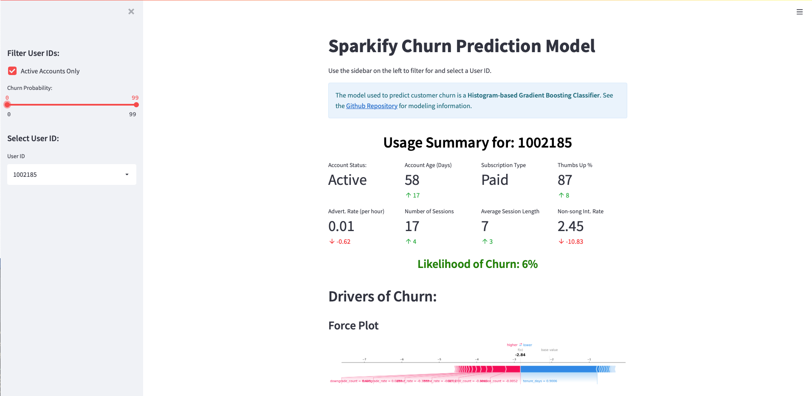
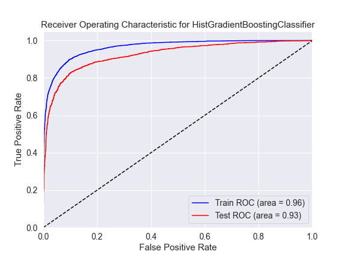
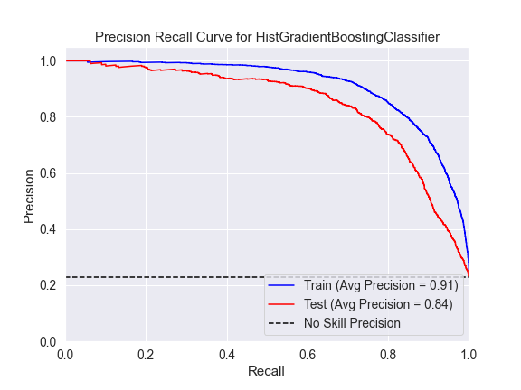
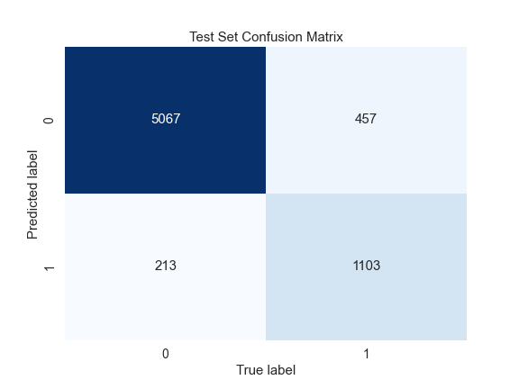
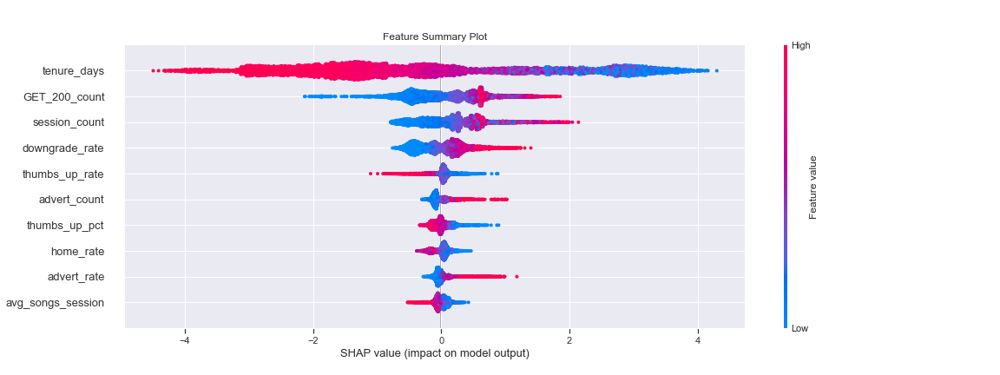
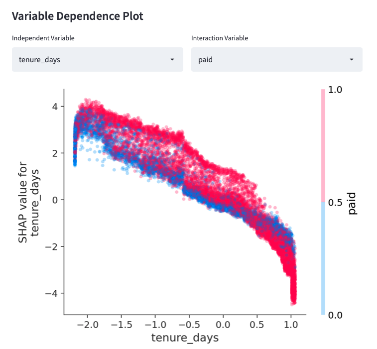

# Customer Retention Modeling using Spark, SHAP, and Streamlit  

## Background
One major challenge with a subscription-based service is retaining customers. A fictitious digital music 
company, Sparkify, is looking to implement a customer retention strategy to reduce churn. Customers use their platform
to stream music using either a free or paid subscription. Their data engineering team has set-up user monitoring logs that tracks
how customers use their platform. Sparkify would like to explore the use of these logs to determine if they can predict
which customers are likely to cancel their service, and why. 

## Project Deliverable
The goal of this project is to build and select a machine learning model model with the highest f1-score. 
Using this model, create an application to identify high risk customers and provide insights into what contributes to 
their elevated risk risk. 


### Set-Up & Installation

For local installations (e.g.  on a laptop), create a clean virtual environment using Python 3.8. Once your virtual
 environment is created, use pip to install the package requirements:

```bash 
pip install -r requirements.txt
```

This project also leveraged [Microsoft Azure Databricks](https://azure.microsoft.com/en-us/free/databricks/) to perform 
data cleaning, feature engineering, and model training at scale. There are two *.ipynb files that require Microsoft 
Azure Databricks Runtime Version 10.1. All of the Spark code is based on v3.2.0. 

### Repository Structure
```bash
├── README.md       
├── app.py
├── data                                        # contains all data for project
│   ├── mini_sparkify_event_data.json
│   ├── test_data_full
│   ├── test_data_sample
│   ├── train_data_full
│   └── train_data_sample
├── images                                      # images for readme
│   ├── db_screenshot.png
│   ├── sparkify.png
│   └── st_app.png
├── models                                      # trained spark and sklearn models
│   ├── gbt_model_sample
│   ├── sklearn_gbc_full.pkl
│   ├── sklearn_gbc_sample.pkl
│   ├── sklearn_lr_full.pkl
│   ├── sklearn_lr_sample.pkl
│   ├── spark_gbt_model_sample
│   └── spark_lr_model_sample
├── notebooks                                   # Jupyter notebooks used to develop models
│   ├── 1_databricks_cleaning_feature_engineering_full_data.ipynb
│   ├── 1_eda_cleaning_feature_engineering_sample.ipynb
│   ├── 2_databricks_train_eval_spark_model_full_data.ipynb
│   ├── 2_sklearn_model_training_evaluation_full.ipynb
│   ├── 2_sklearn_model_training_evaluation_sample.ipynb
│   ├── 2_spark_model_training_evaluation_sample.ipynb
│   └── 3_prediction_explainers.ipynb  
├── output                                      # Model performance graphs and confusion matrices
│   ├── pyspark
│   │   ├── full
│   │   │   ├── GBT_Classifier_PR.png
│   │   │   ├── GBT_Classifier_ROC.png
│   │   │   ├── GBT_Classifier_test_cm.png
│   │   │   ├── GBT_Classifier_train_cm.png
│   │   │   ├── Logistic_Regression_PR.png
│   │   │   ├── Logistic_Regression_ROC.png
│   │   │   ├── Logistic_Regression_test_cm.png
│   │   │   └── Logistic_Regression_train_cm.png
│   │   └── sample
│   │       ├── GBT_PR.png
│   │       ├── GBT_ROC.png
│   │       ├── GBT_test_cm.png
│   │       ├── GBT_train_cm.png
│   │       ├── Logistic_Regression_PR.png
│   │       ├── Logistic_Regression_ROC.png
│   │       ├── Logistic_Regression_test_cm.png
│   │       └── Logistic_Regression_train_cm.png
│   ├── shap_summary.png
│   └── sklearn
│       ├── full
│       │   ├── HistGradientBoostingClassifier_PR.png
│       │   ├── HistGradientBoostingClassifier_ROC.png
│       │   ├── HistGradientBoostingClassifier_test_cm.png
│       │   ├── HistGradientBoostingClassifier_train_cm.png
│       │   ├── Logistic_Regression_PR.png
│       │   ├── Logistic_Regression_ROC.png
│       │   ├── Logistic_Regression_test_cm.png
│       │   └── Logistic_Regression_train_cm.png
│       └── sample
│           ├── HistGradientBoostingClassifier_PR.png
│           ├── HistGradientBoostingClassifier_ROC.png
│           ├── HistGradientBoostingClassifier_test_cm.png
│           ├── HistGradientBoostingClassifier_train_cm.png
│           ├── Logistic_Regression_PR.png
│           ├── Logistic_Regression_ROC.png
│           ├── Logistic_Regression_test_cm.png
│           └── Logistic_Regression_train_cm.png
├── requirements.txt
├── src
│   └── sparkifychurn                           #Python package of key data processing and modeling functionality. 
│       ├── __init__.py
│       ├── cleanData.py
│       ├── evaluateModel.py
│       ├── exploreData.py
│       ├── generateFeatures.py
│       ├── trainModel.py
│       └── utils.py
```
### File Descriptions
**app.py** - Sparkify Churn Prediction Model Dashboard built with Streamlit. 
**mini_sparkify_event_data.json** - Sample customer logs provided by Sparkify.  
**test_data_full** - Parquet files containing the full test data set.  
**test_data_sample** - Parquet files containing a sample test data set.  
**train_data_full** - Parquet files containing the full training data set.  
**train_data_sample** - Parquet files containing a sample training data set.  

**1_databricks_cleaning_feature_engineering_full_data.ipynb** - Clean data and engineer features at scale using Databricks.  
**1_eda_cleaning_feature_engineering_sample.ipynb** - Clean data and engineer features for a sample of data.  
**2_databricks_train_eval_spark_model_full_data.ipynb** - Train PySpark models on the full dataset using Databricks.   
**2_sklearn_model_training_evaluation_full.ipynb** - Train scikit-learn models on full data set.  
**2_sklearn_model_training_evaluation_sample.ipynb** - Train scikit-learn models on sample data set.  
**2_spark_model_training_evaluation_sample.ipynb** - Train PySpark models on a sample data set.  
**prediction_explainers.ipynb** - Explore top model's SHAP values.  


*Directories:*  
**output/pyspark/full** - PySpark model performance plots  on full data set.  
**output/pyspark/sample** - PySpark model performance plots on sample data.  
**output/sklearn/full** - Scikit-learn model performance plots  on full data set.  
**output/sklearn/sample** - Scikit-learn model performance plots on sample data.  
**requirements.txt** - Contains package requirements to run code.
**src/sparkifychurn** - Python package containing key functions to process data and train PySpark models. 

### EDA, Data Cleaning & Feature Engineering 
There are two notebooks associated with exploratory data analysis, cleaning, and feature engineering. I started with the
`1_eda_cleaning_feature_engineering_sample.ipynb` where I thoroughly explored a sample of the data and wrote some data 
cleaning functions available in the `sparkifychurn` package. Once I had developed code to clean and engineer the data, I 
scaled up the work using Microsoft Azure Databricks. Using a Spark cluster, I cleaned and transformed a 12 GB data set. 

### Model Training & Evaluation
There are four notebooks associated with model training and evaluation. Initial development took place using 
`2_spark_model_training_evaluation_sample.ipynb`.  Once the model training pipelines were set-up, and model evaluation 
functions were written in `sparkify`, they were scaled on Databricks in `2_databricks_train_eval_spark_model_full_data.ipynb`.  
 
  

*Mlflow* was used to track model experiments and persisting the model object:  
  
  

Similar scikit-learn models were also explored for their feasibility. While the initial log file was large, transforming 
it into one-row per customer significantly reduced its dimensionality, making scikit-learn models an option. 
The two associated notebooks are 
 `2_sklearn_model_training_evaluation_sample.ipynb` and  `2_sklearn_model_training_evaluation_full.ipynb`. 

### Model Explainability 
After training and evaluating the models, the top scikit-learn model was used to calculate shapely
values. [SHAP]( identifies the most informative relationships between the input features) identifies the most 
informative relationships between the input features and the predicted outcome (e.g. `churn`), which is useful for 
explaining how the model arrived at it's prediction. The overall feature importance/summary plot and an example of an 
individual observation's shapely values can be found in `3_prediction_explainers.ipynb `.


### Web Application
The Streamlit web application ties relevant customer attributes, churn prediction, and drivers of churn together in an 
easy to use interface. To use the web application, type in the command line in the root directory of the project: 
```bash
streamlit run app.py
```
Once the application loads, it will be available on a local port:  



When you navigate to the webpage, you should see the following dashboard render:  


## Analysis
The 12GB customer log data was cleaned and aggregated to the customer-level with 49 features summarizing their usage 
history. 

| Number of Rows | Number of customers | # Customers Churned |
| ---- | ---- | ---- |
| 26,259,199 | 22,278 | 5,003 (22%)|


The 22,278 customers were divided into a train/test split using proportional stratification on the target feature 
e.g. `churn`). For additional exploratory data analysis and feature engineering development, check out 
`1_eda_cleaning_feature_engineering_sample.ipynb`.  

Four models were hyperparameter tuned via cross-validation on the train set and evaluated based on their
average precision, F1-score, and AUROC on the test set. The decision to focus on precision is due to the 
moderate class imbalance in the target feature.  These models include:  
  
**PySpark Models:**   
* Logistic Regression
* GBTClassifier

**Scikit-Learn Models:**
* Logistic Regression 
* HistGradientBoostingClassifier

The trained models are saved in the `models` directory and the model performance plots are available in the `output` 
folder.

The model results are shown in the table below.

| Model | Type | F1-Score | Average Precision |	AUROC |
|----|-----|-----|-----|-----|
| Logistic Regression | Spark | 0.63 | 0.69 | 0.88 |  
| Logistic Regression | Scikit-Learn | 0.63 | 0.68 | 0.88 | 
| Gradient Boosting Classifier	| Spark | 0.73 | 0.82 | 0.92 |
| **Histogram-based Gradient Boosting Classier** | Scikit-Learn	| 0.77 | 0.84 | 0.93 |

 The gradient boosting tree classifiers have higher performance metrics overall, with the scikit-learn model having a 
 slight edge over its spark counterpart. Below are the ROC and PR curves for the top model:
 

   
  

The HistGradientBoostingClassifier model has some slight overfitting, but is still the best choice. The trained model 
object is used to predict churn likelihood and compute model explainers via SHAP.


## Findings
### Feature Importance
To calculate feature importance, SHAP values are calculated for each observation (e.g. customer) and their magnitudes 
are summed up for each feature and sorted from most to least. The SHAP values for the top 10 features are displayed as a 
density scatter plot below:  



The feature that had the highest impact on the churn prediction is a customer's tenure. The longer a customer has been a
member of the streaming service, the more likely they are to stay. Using a dependence plot, we can see how SHAP values 
are impacted by tenure and subscription type (e.g. paid vs free) in the Streamlit application: 


Other notable features and their effects include: 

* `downgrade_rate`: Customers that cancelled their paid subscription are more likely to completely cancel their account.
* `thumbs_up_rate` & `thumbs_up_pct`: Customers that like the songs played more often have a lower risk of churn. 
* `advert_count` & `advert_rate`: More advertisements result in a higher risk of churn. 
* `avg_songs_session`: Customers that listen to more songs a session have a lower risk of churn.

### Target Customers  
Using the Streamlit application and filtering for only active customers with at least a 50% probability of churn yield
476 customers to target for their customer retention strategy. 

### Challenges & Opportunities 
Using Microsoft Azure Databricks was a great experience and I really enjoyed the integration with *mlflow* and the 
Databricks File System (DBFS) to save modeling outputs. I was able to perform data cleaning and feature engineering at 
scale with relative ease and fairly fast performance. However, when training PySpark models on only ~22,000 customers, 
the performance was slower than using scikit-learn even after using coalesce to minimize data shuffling for such a small 
data set. Using a combination of Spark for data cleaning and feature engineering and scikit-learn for model training and 
inference is the optimal solution. 

One key improvement would be to create scripts from the Jupyter notebooks to be run on a scheduled basis to regularly 
update the data cleaning, feature engineering and model training pipelines. 