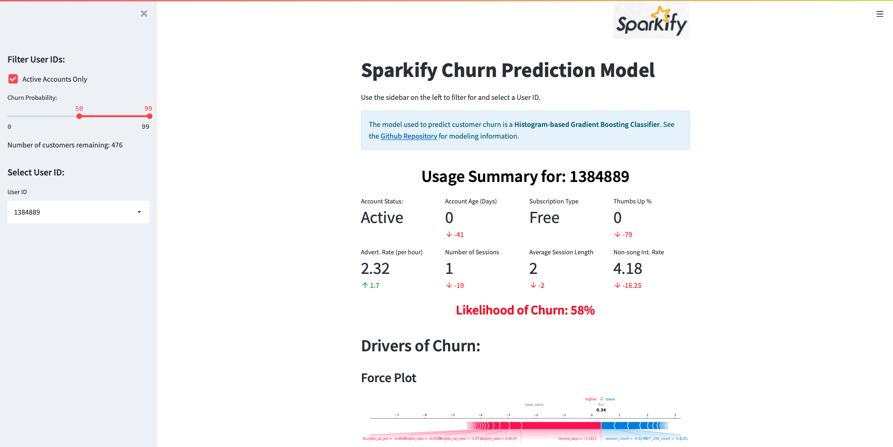
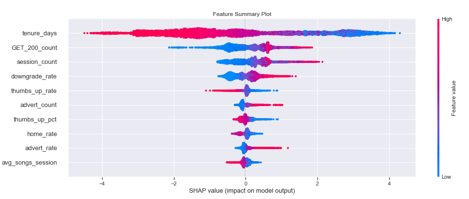

# Customer Retention Modeling using Spark, SHAP, and Streamlit  

## Project Overview
One major challenge of a subscription-based service is retaining customers. A fictitious digital music 
company, Sparkify, wants to implement a customer retention strategy to reduce churn. Customers use their platform
to stream music using either a free or paid subscription. Their data engineering team has set-up user monitoring logs that tracks
how customers interact with their platform. Every time a new song plays, a customer clicks the web page, or thumbs-up a 
song, etc., a log entry is created. 

### Problem Statement
Sparkify would like to use their customer logs to model customer behavior and determine which active customer have a high
likelihood of churn (e.g. cancelling their account). Furthermore, the business would like to understand what customer 
usage patterns contribute most to their elevated level of risk. All of this should be displayed in an easy to use web
application.

### Metrics
The model with the highest average precision on the test will be selected and used as a basis to predict customer churn and as 
an input to calculate SHAP values for each customer. The decision to focus on precision is due to the 
moderate class imbalance in the target feature. The prediction combined with the model explainability provided by 
SHAP will give the business insight into what is driving the model's predictions.

## Set-Up & Installation

For local installations (e.g. on a laptop), create a clean virtual environment using Python 3.8. Once your virtual
 environment is created, use pip to install the package requirements:

```bash 
pip install -r requirements.txt
```

This project also leveraged [Microsoft Azure Databricks](https://azure.microsoft.com/en-us/free/databricks/) to perform 
data cleaning, feature engineering, and model training at scale. There are two *.ipynb files that require Microsoft 
Azure Databricks Runtime Version 10.1. All of the Spark code is based on v3.2.0. 

### Web Application
The Streamlit web application ties relevant customer attributes, churn prediction, and drivers of churn together in an 
easy to use interface. To use the web application, type in the command line in the root directory of the project: 
```bash
streamlit run app.py
```
Once the application loads, it will be available on a local port:  


When you navigate to the webpage, you should see the following dashboard render:  


## Repository Structure
A tree-diagram of the repository's structure can be found [here](tree.txt).  

### File Descriptions
**app.py** - Sparkify Churn Prediction Model Dashboard built with Streamlit.  
**mini_sparkify_event_data.json** - Sample customer logs provided by Sparkify.    
**test_data_full** - Parquet files containing the full test data set.  
**test_data_sample** - Parquet files containing a sample test data set.  
**train_data_full** - Parquet files containing the full training data set.  
**train_data_sample** - Parquet files containing a sample training data set.  

**1_databricks_cleaning_feature_engineering_full_data.ipynb** - Clean data and engineer features at scale using Databricks.  
**1_eda_cleaning_feature_engineering_sample.ipynb** - Clean data and engineer features for a sample of data.  
**2_databricks_train_eval_spark_model_full_data.ipynb** - Train PySpark models on the full dataset using Databricks.   
**2_sklearn_model_training_evaluation_full.ipynb** - Train scikit-learn models on full data set.  
**2_sklearn_model_training_evaluation_sample.ipynb** - Train scikit-learn models on sample data set.  
**2_spark_model_training_evaluation_sample.ipynb** - Train PySpark models on a sample data set.  
**prediction_explainers.ipynb** - Explore top model's SHAP values.  


### Directories  
**output/pyspark/full** - PySpark model performance plots  on full data set.  
**output/pyspark/sample** - PySpark model performance plots on sample data.  
**output/sklearn/full** - Scikit-learn model performance plots  on full data set.  
**output/sklearn/sample** - Scikit-learn model performance plots on sample data.  
**requirements.txt** - Contains package requirements to run code.
**src/sparkifychurn** - Python package containing key functions to process data and train PySpark models. 
  
## Raw Data Exploration & Visualization
The raw 12GB customer log file was read into a Databricks Spark cluster from an 
[S3 bucket]("s3n://udacity-dsnd/sparkify/sparkify_event_data.json). Each row corresponds to a customer interaction 
with the streaming platform. The top 5 rows of the raw data are shown below: 
   
  

A custom PySpark function, [summarize_missing_vals()](./src/sparkifychurn/exploreData.py), was written to assess the data 
quality of the raw customer logs. Some of the features in the raw data had an upwards of 20% missing: 
  
   
  
The missing values correlated with customer interactions that did not require populating 
that field. For example, if a customer navigates to the 'Help' screen, the 'artist' field is not populated since that 
feature is only populated when a log entry is capturing a new song playing. There was also a very small subset of the 
log data where the `userId` was missing. The timestamps also needed to be converted into a format that could be used to 
compute the total duration of customer listening sessions. 

A key column in the data that best describes the type of customer interaction is `page`. 
The different interaction types and their counts are shown in the sorted bar plot below: 
 

Using the various customer interaction types will be key in predicting churn. 

## Data Preprocessing & Feature Engineering
A custom PySpark function, [clean_logs()](./src/sparkifychurn/cleanData.py), was written to clean up timestamps, remove 
logs with a `userId`, and fill missing `length` values with 0. The `length` feature refers to the duration of the music 
playing in seconds. After doing an initial cleaning, the log file needed to be aggregated to the customer level for 
model training and inference. To generate features, a custom PySpark function, 
[generate_features()](./src/sparkifychurn/generateFeatures.py), was written. This function summarizes the data 
with respect to the `userId` and `sessionId`. The `sessionId` is a single continuous set of interactions
between a customer and the Sparkify platform. If a customer leaves the platform or logs out and returns, a new 
`sessionId` is created. The target feature is also created in this function. It is a binary flag indicating if a customer 
has a "Cancellation Confirmation" `page` interaction. This page interaction occurs when a customer cancels their account.
The feature engineering function results in 49 features that summarizes a customer's usage history. Rates of interactions are
also computed. These rates indicate how often certain interactions occur in relation to the customer's total engagement 
time with the platform. A high level summary of the data is shown in the table below:

| Number of Rows | Number of customers | # Customers Churned |
| ---- | ---- | ---- |
| 26,259,199 | 22,278 | 5,003 (22%)|

## Train-Test Split 
The 22,278 customer rows were divided into a 70/30 train-test split using 
[proportional stratification](./src/sparkifychurn/utils.py) on the target feature (e.g. `churn`).

**Train Size:** (15438, 50)  
**Test Size:** (6840, 50)

## Training Data Exploration & Visualization

The average value for a subset of features was calculated based on `churn` is shown below:  
  


The training data indicates that active customers have, on average:
 * Longer tenure
 * Lower thumbs down rate
 * Higher interaction rate
 * Higher thumbs up percent
 * Lower advertisement rate  
  
It's difficult to say if these uni-variate trends hold true during modeling. Looking at violin plots of some of these 
features indicate skew. For example, there are some customers with abnormally high advertisement rates: 
  
  
Model explainability via SHAP will help confirm these trends to see if they hold true globally as well as for individual 
customers.  
  
Additional feature exploration on the training data can be found in 
[1_databricks_cleaning_feature_engineering_full_data.ipynb](./notebooks/1_databricks_cleaning_feature_engineering_full_data.ipynb). 
Note that this notebook requires Databricks to run. For a similar analysis on a much smaller data sample that can be 
explored using a laptop can be found in
[1_eda_cleaning_feature_engineering_sample.ipynb](./notebooks/1_eda_cleaning_feature_engineering_sample.ipynb).  
     
## Implementation 
The analysis for Sparkify was initially performed on a sample data set, then scaled using Microsoft Azure Databricks. 
The notebooks associated with initial development are: 
* [1_eda_cleaning_feature_engineering_sample.ipynb](./notebooks/1_eda_cleaning_feature_engineering_sample.ipynb)
* [2_spark_model_training_evaluation_sample.ipynb](./notebooks/2_spark_model_training_evaluation_sample.ipynb)

After doing the initial analysis locally, I packaged up the key modeling functions into the [sparkifychurn](./src/sparkifychurn)
 package found in the src folder. Using these functions, I ran the end-to-end modeling pipeline at scale on Databricks using:  
* [1_databricks_cleaning_feature_engineering_full_data.ipynb](./notebooks/1_databricks_cleaning_feature_engineering_full_data.ipynb)
* [2_databricks_train_eval_spark_model_full_data.ipynb](./notebooks/2_databricks_train_eval_spark_model_full_data.ipynb)

*Mlflow* was used to track model experiments and persist the model objects:  
  
 

### Refinement
Building the data cleaning and feature engineering functionality on the sample data did not cover all of the same data
quality issues that were found in the data at scale. For example, a customer's gender  was missing in the full
data set but not in the sample provided by the business. The data pre-processing pipeline was updated to accommodate 
missing gender during scoring by creating a new category for that feature. 

There were also performance challenges with running model training at scale using hyperparameter tuning via grid-search
and 5-fold cross-validation. As a result, I had to lower the number of folds to two and coalesce the dataframe down to 
a single partition. Reducing data to a single partition when the data set is small reduces data shuffles across the 
cluster and can greatly improve runtime. As a result, training time was reduced from hours to about 15 minutes. 

Similar scikit-learn models were also explored for their feasibility. While the initial log file was large, transforming 
it into one-row per customer significantly reduced its dimensionality allowing scikit-learn models as an option. There 
are two associated notebooks with scikit-learn modeling pipelines: 
* [2_sklearn_model_training_evaluation_sample.ipynb](./notebooks/2_sklearn_model_training_evaluation_sample.ipynb)
* [2_sklearn_model_training_evaluation_full.ipynb](./notebooks/2_sklearn_model_training_evaluation_full.ipynb)


### Model Evaluation and Validation
Four models were hyperparameter tuned via cross-validation on the train set and evaluated based on their
average precision, F1-score, and AUROC on the test set: 
  
**PySpark Models:**   
* Logistic Regression
* GBTClassifier

**Scikit-Learn Models:**
* Logistic Regression 
* HistGradientBoostingClassifier

The trained models are saved in the `models` directory and the model performance plots are available in the `output` 
folder. The model results are shown in the table below.  

| Model | Type | F1-Score | Average Precision |	AUROC |
|----|-----|-----|-----|-----|
| Logistic Regression | Spark | 0.63 | 0.69 | 0.88 |  
| Logistic Regression | Scikit-Learn | 0.63 | 0.68 | 0.88 | 
| Gradient Boosting Classifier	| Spark | 0.73 | 0.82 | 0.92 |
| **Histogram-based Gradient Boosting Classier** | Scikit-Learn	| 0.77 | 0.84 | 0.93 |


### Model Selection & Justification
The gradient boosting tree classifiers have higher performance metrics overall, with the scikit-learn model having a 
slight edge over its Spark counterpart. The results are not surprising. Tree-based methods allow non-linear patterns to 
be modeled, unlike logistic regression. Furthermore, the use of boosting iterations allow subsequent trees to better 
model observations by focusing on those with higher prediction error. Below are the ROC and PR curves for the top model:  
 

   
  

The HistGradientBoostingClassifier model has some slight overfitting, but is the best choice. It has the best performance,
trained faster than its Spark counterpart, and the pipeline object is compatible with SHAP. This model was recommended to
the business as a means to predict churn and compute model explainers via SHAP.

## Findings
### Feature Importance
To calculate feature importance, SHAP values are calculated for each observation (e.g. customer) and their magnitudes 
are summed up for each feature and sorted from most to least. The SHAP values for the top 10 features are displayed as a 
density scatter plot below:  



The feature that had the highest impact on the churn prediction is a customer's tenure. The longer a customer has been a
member of the streaming service, the more likely they are to stay. Using a dependence plot, we can see how SHAP values 
are impacted by tenure and subscription type (e.g. paid vs free) in the Streamlit application: 


Other notable features and their effects include: 

* `downgrade_rate`: Customers that cancelled their paid subscription are more likely to completely cancel their account.
* `thumbs_up_rate` & `thumbs_up_pct`: Customers that like the songs played more often have a lower risk of churn. 
* `advert_count` & `advert_rate`: More advertisements result in a higher risk of churn. 
* `avg_songs_session`: Customers that listen to more songs a session have a lower risk of churn.

### Target Customers  
Using the Streamlit application and filtering for only active customers with at least a 50% probability of churn yield
476 customers to target for their customer retention strategy. 

## Reflection
Using Microsoft Azure Databricks was a great experience and I really enjoyed the integration with *mlflow* and the 
Databricks File System (DBFS) to save modeling outputs. I was able to perform data cleaning and feature engineering at 
scale with relative ease and fairly fast performance. However, when training PySpark models on only ~22,000 customers, 
the performance was slower than using scikit-learn even after using coalesce to minimize data shuffling for such a small 
data set. Using a combination of Spark for data cleaning and feature engineering and scikit-learn for model training and 
inference is the optimal solution. 


### Future Improvements
One key improvement would be to create scripts from the Jupyter notebooks to be run on a scheduled basis to regularly 
update the data cleaning, feature engineering and model training pipelines. While there are some ways to "deploy" 
Jupyter notebooks, scripts are more widely deployable and the defacto method for production pipelines. 

Requiring business stakeholders to run the web application from the command line isn't realistic. Another improvement 
would be to deploy the Streamlit dashboard using a hosting service such as Heroku. That way, stakeholders could simply
log-in and explore the model's predictions and drivers of churn.